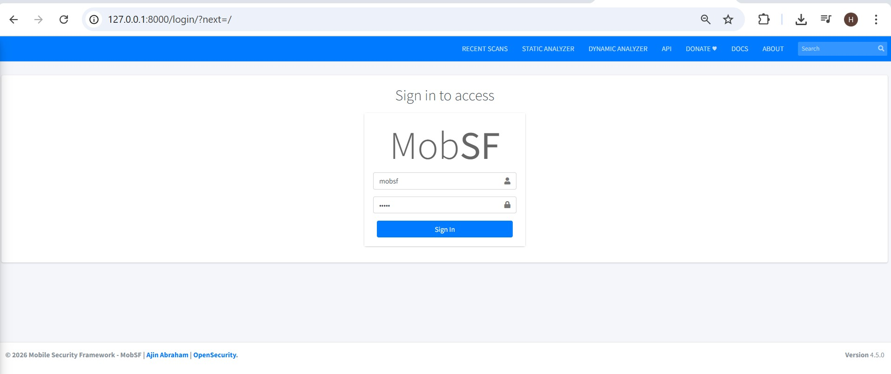
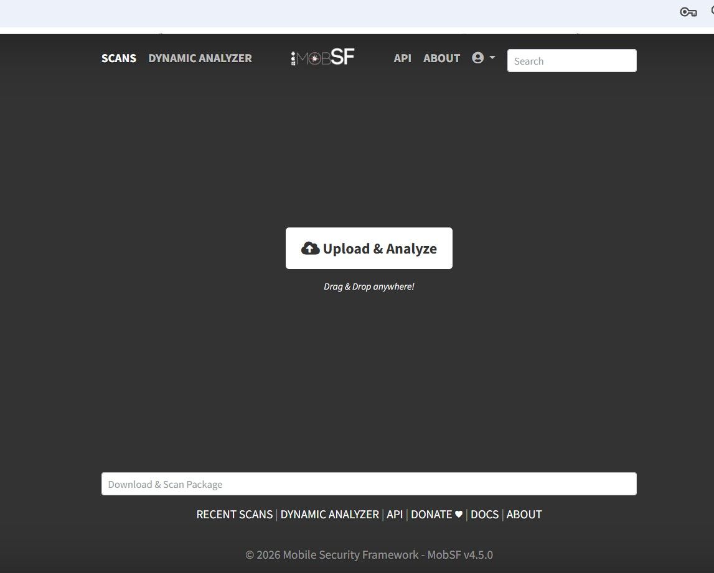
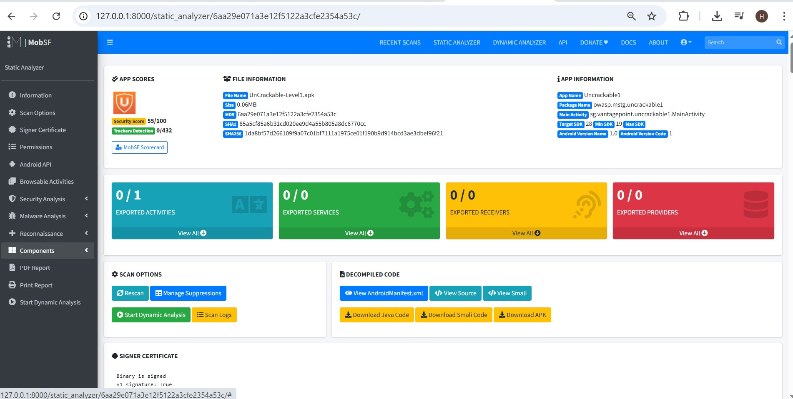
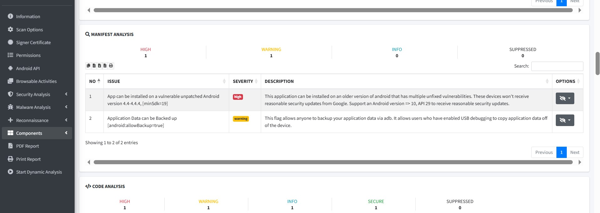
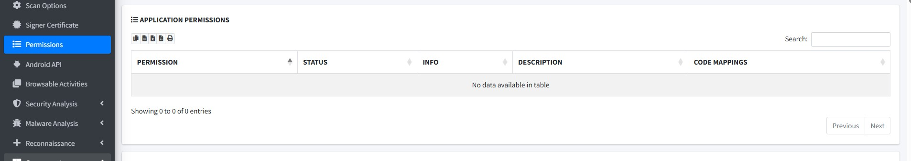
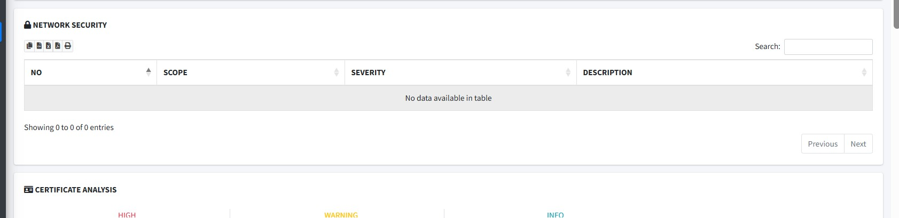
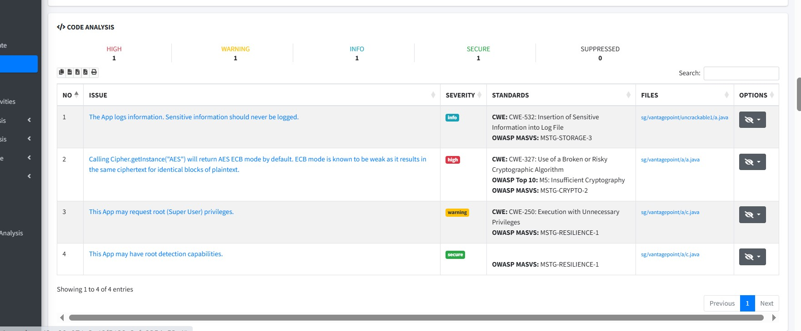
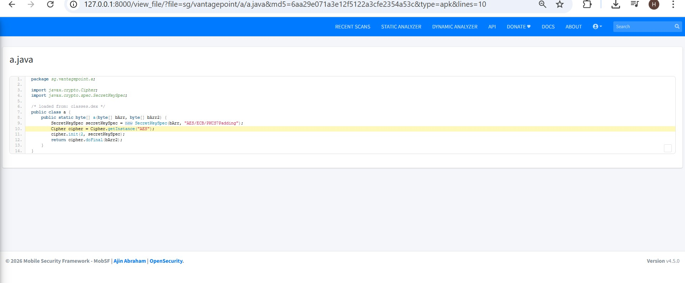
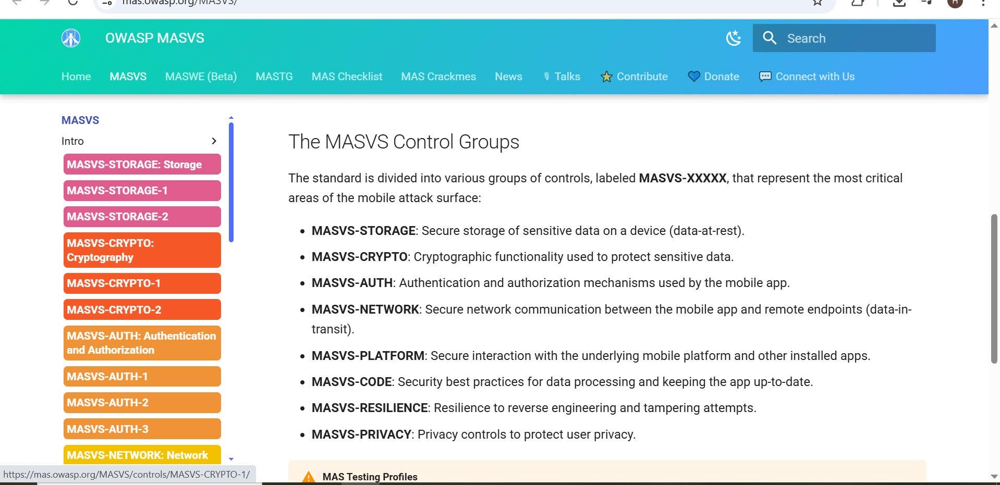

# LAB 6 — Analyse Statique d'APK avec MobSF

**Module :** Sécurité des Applications Mobiles  
**Outil :** Mobile Security Framework (MobSF) v4.5.0  
**APK analysé :** `UnCrackable-Level1.apk` (OWASP MAS Crackmes)   

---

## Objectifs

- Analyser statiquement un APK avec MobSF
- Identifier les vulnérabilités du manifeste, du code et de la configuration réseau
- Associer les vulnérabilités aux standards OWASP MASVS
- Produire un mini-rapport d'audit de sécurité

---

## Environnement

- OS : Windows 11
- MobSF v4.5.0 installé localement (via `setup.bat`)
- Python 3.13.0
- APK : `UnCrackable-Level1.apk` — application pédagogique OWASP

---

## Task 1 — Préparation de l'environnement

MobSF installé localement sur Windows via le script officiel `setup.bat`.  
APK pédagogique `UnCrackable-Level1.apk` (SHA256 : `1da8bf57d266109f9a07c01bf7111a1975ce01f190b9d914bcd3ae3dbef96f21`) copié dans le dossier de travail.

---

## Task 2 — Lancement de MobSF

MobSF lancé via `run.bat`, accessible sur `http://127.0.0.1:8000`.  
Connexion avec les identifiants par défaut (`mobsf/mobsf`).

**Capture — Page de connexion MobSF :**

**Capture — Interface d'accueil (Upload & Analyze) :**

---

## Task 3 — Import et analyse de l'APK

L'APK a été uploadé via le bouton "Upload & Analyze". MobSF a effectué l'analyse statique complète et généré le rapport.

**Résultats principaux :**
- **Security Score : 55/100**
- Package : `owasp.mstg.uncrackable1`
- Target SDK : 28 | Min SDK : 19
- Composants exportés : 0 activité, 0 service, 0 receiver, 0 provider

**Capture — Dashboard d'analyse (Security Score + File Information) :**

---

## Task 4 — Analyse du manifeste et des permissions

### Manifest Analysis

MobSF a détecté **1 issue HIGH** et **1 WARNING** dans le manifeste.

| # | Issue | Sévérité | Description |
|---|-------|----------|-------------|
| 1 | App installable sur Android 4.4 (minSdk=19) | HIGH | Versions Android avec vulnérabilités non corrigées |
| 2 | `android:allowBackup=true` | WARNING | Permet la copie des données via ADB |

**Capture — Manifest Analysis :**

### Permissions

L'application ne déclare **aucune permission** dans son manifeste — surface d'attaque réduite sur ce point.

**Capture — Application Permissions (aucune permission déclarée) :**

---

## Task 5 — Analyse de la configuration réseau

La section **Network Security** ne présente aucune entrée (`No data available`). L'application n'implémente pas de fichier `network_security_config.xml` explicite.

**Observation :** En l'absence de configuration réseau dédiée, l'application hérite du comportement par défaut Android, ce qui peut autoriser des communications non chiffrées selon le niveau d'API cible.

**Capture — Network Security :**

---

## Task 6 — Analyse du code

### Code Analysis — 4 issues détectées

| # | Issue | Sévérité | Standard | Fichier |
|---|-------|----------|----------|---------|
| 1 | L'application logue des informations sensibles | INFO | MSTG-STORAGE-3 | `a.java` |
| 2 | `Cipher.getInstance("AES")` — AES ECB mode (faible) | HIGH | MSTG-CRYPTO-2 | `a.java` |
| 3 | L'app peut demander les privilèges root | WARNING | MSTG-RESILIENCE-1 | `c.java` |
| 4 | L'app peut détecter le root | SECURE | MSTG-RESILIENCE-1 | `c.java` |

**Capture — Code Analysis :**

### Détail — Vulnérabilité critique (AES ECB)

Le fichier `a.java` utilise `Cipher.getInstance("AES")` qui retourne par défaut le mode **ECB (Electronic Codebook)**. Ce mode est cryptographiquement faible car il produit le même ciphertext pour des blocs de plaintext identiques, permettant des attaques par analyse de pattern.

**Capture — Code source `a.java` avec la ligne vulnérable mise en évidence :**

---

## Task 7 — Corrélation OWASP MASVS

Référence : [https://mas.owasp.org/MASVS/](https://mas.owasp.org/MASVS/)

**Capture — Site OWASP MASVS :**

### Tableau de corrélation

| Vulnérabilité | Référence MASVS | Catégorie | Non-conformité |
|---|---|---|---|
| AES ECB mode utilisé | **MASVS-CRYPTO-2** | Cryptographie | `Cipher.getInstance("AES")` dans `a.java` ligne 10 |
| `android:allowBackup=true` | **MASVS-STORAGE-2** | Stockage | AndroidManifest.xml |
| MinSdk=19 (Android 4.4) | **MASVS-CODE-1** | Code | `minSdkVersion` trop bas dans le manifeste |
| Log d'informations sensibles | **MASVS-STORAGE-3** | Stockage | `a.java` — logs non filtrés |
| Absence Network Security Config | **MASVS-NETWORK-1** | Réseau | Pas de `network_security_config.xml` |

### Tests MASTG complémentaires

**MASTG-TEST-0013** — Testing for Sensitive Data in Logs : vérifier que les logs ne contiennent pas de données sensibles (tokens, mots de passe, clés).

**MASTG-TEST-0014** — Testing Encryption Configuration : vérifier que les algorithmes cryptographiques utilisés sont conformes aux recommandations actuelles (AES-GCM ou AES-CBC, pas ECB).

---

### Résumé exécutif

L'analyse statique de l'application `UnCrackable-Level1` révèle un niveau de risque **moyen à élevé**. Les principales vulnérabilités concernent l'utilisation d'un algorithme cryptographique faible (AES ECB), la configuration de sauvegarde non restreinte, et l'absence de politique de sécurité réseau explicite. Le score MobSF de 55/100 confirme plusieurs non-conformités aux standards OWASP MASVS. Ces problèmes doivent être corrigés avant tout déploiement en production.

### Top 3 vulnérabilités

**1. Utilisation de AES ECB — Sévérité : HIGH**
- **MASVS :** MASVS-CRYPTO-2
- **Preuve :** `a.java` ligne 10 — `Cipher.getInstance("AES")` retourne ECB par défaut
- **Impact :** Un attaquant peut analyser les patterns du ciphertext pour retrouver le plaintext
- **Remédiation :** Remplacer par `Cipher.getInstance("AES/GCM/NoPadding")` ou `AES/CBC/PKCS5Padding`

**2. android:allowBackup=true — Sévérité : WARNING**
- **MASVS :** MASVS-STORAGE-2
- **Preuve :** `AndroidManifest.xml` — attribut `android:allowBackup="true"`
- **Impact :** Un attaquant avec accès USB peut extraire toutes les données de l'application via `adb backup`
- **Remédiation :** Passer à `android:allowBackup="false"` ou définir des règles de backup sélectives

**3. MinSdk trop bas (API 19 / Android 4.4) — Sévérité : HIGH**
- **MASVS :** MASVS-CODE-1
- **Preuve :** `AndroidManifest.xml` — `minSdkVersion=19`
- **Impact :** L'application peut être installée sur des appareils avec des vulnérabilités système non corrigées
- **Remédiation :** Définir `minSdkVersion >= 29` (Android 10) pour bénéficier des protections modernes

### Recommandations prioritaires

1. Remplacer `Cipher.getInstance("AES")` par un mode sécurisé (AES-GCM ou AES-CBC)
2. Désactiver `android:allowBackup` ou restreindre les données sauvegardées
3. Augmenter le `minSdkVersion` à 29 minimum
4. Ajouter un fichier `network_security_config.xml` bloquant le trafic HTTP en clair
5. Supprimer ou filtrer les logs contenant des informations potentiellement sensibles

### Faux positifs identifiés

- **"App may request root privileges"** (WARNING) : détection basée sur des patterns de code génériques. Dans le contexte de cette application pédagogique, il s'agit d'une détection de root côté défense, non d'une demande de privilèges malveillante.

---

## Ressources

- [MobSF GitHub](https://github.com/MobSF/Mobile-Security-Framework-MobSF)
- [OWASP MASVS](https://mas.owasp.org/MASVS/)
- [OWASP MASTG](https://mas.owasp.org/MASTG/)
- [Android Security Best Practices](https://developer.android.com/privacy-and-security/security-best-practices)
- [Network Security Configuration](https://developer.android.com/privacy-and-security/security-config)
